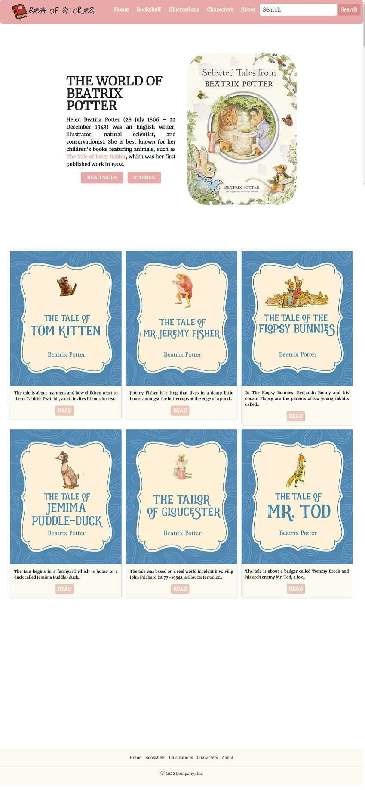
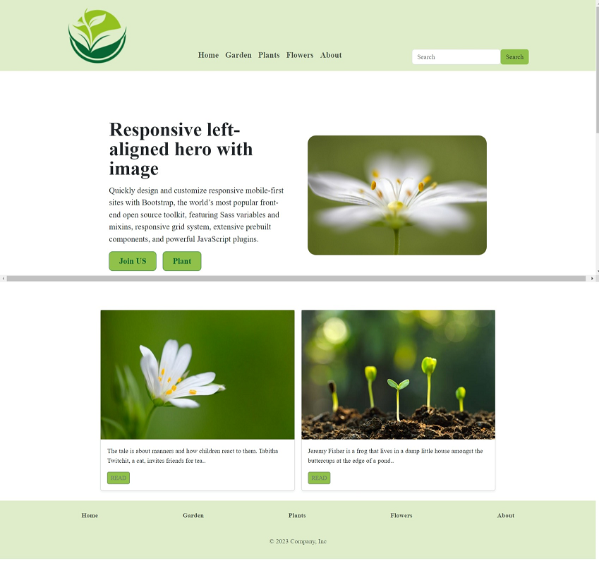

# bootstrap-task

* ###   TASK: Create a webpage that includes the following:

  - A navbar

  - Hero section with background image and two buttons centered at the bottom of the hero.

  - 3 cards in between (use grid to adjust the position of it)

  - A footer
  
+Extra Work
* ### **TOOLS ⚙️**
   * **HTML  **
   * **CSS   **
   * **Visual Studio Code **
   * **Bootstrap **

### **PAGES:**
  
  
***AWBGCE*** 🌼❤️ AMANI ZYOUD

